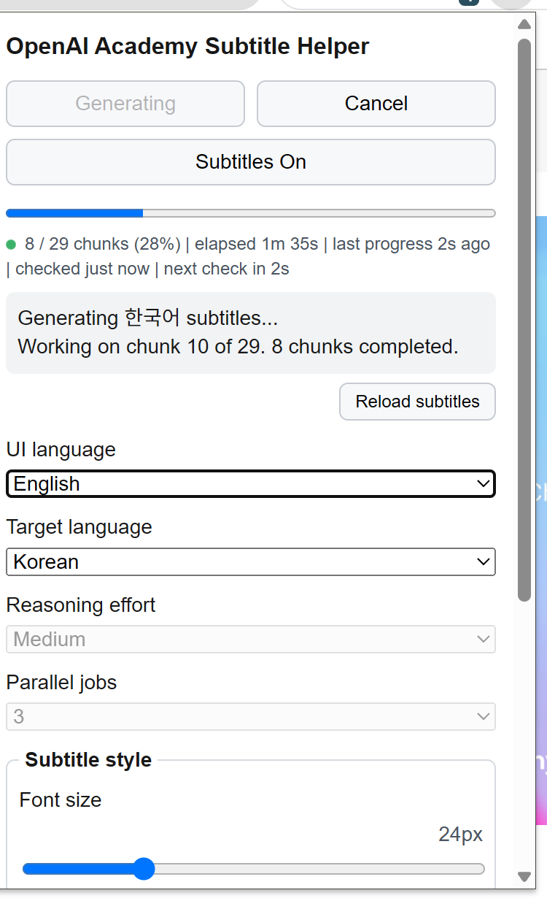
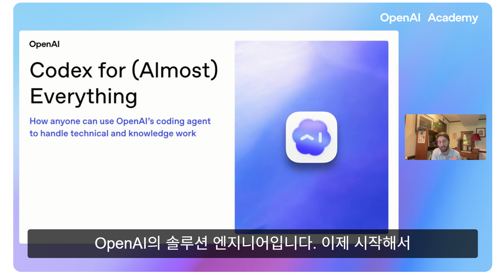

# 비공식 OpenAI Academy 자막 도우미

OpenAI Academy 영상을 영어가 아닌 언어로 더 편하게 보기 위한 로컬 자막 생성 및 표시 도구입니다.

이 프로젝트는 비공식 커뮤니티 프로젝트입니다. OpenAI와 제휴, 보증, 후원을 받은 프로젝트가 아닙니다.

언어: [English](README.md) | [한국어](README.ko.md) | [日本語](README.ja.md) | [简体中文](README.zh-CN.md) | [Español](README.es.md) | [Français](README.fr.md) | [Deutsch](README.de.md)

## 무엇을 하나요?

- Chrome에서 OpenAI Academy 영상 페이지를 감지합니다.
- 이미 생성된 번역 자막이 로컬 캐시에 있으면 자동으로 불러옵니다.
- 자막이 없으면 Codex CLI를 사용해 로컬에서 번역 자막을 생성합니다.
- 생성된 번역 자막을 Academy 영상 플레이어 위에 직접 표시합니다.
- 병렬 생성, 자막 생성 취소와 이어하기, 진행률 표시, 추론 강도 선택, 자막 크기와 위치 조정을 지원합니다.

이 도구는 영상 파일을 다운로드하지 않습니다. 이 저장소에는 Academy 콘텐츠, 원본 자막, 번역 자막, 자막 조각, 추출된 텍스트가 포함되어 있지 않습니다.

## 스크린샷

자막 생성 진행 중인 확장 프로그램 팝업:



Academy 영상 위에 표시되는 번역 자막:



## 지원 언어

Chrome 확장 프로그램에서 선택할 수 있는 번역 대상 언어는 다음과 같습니다.

- 한국어
- 일본어
- 중국어 간체
- 스페인어
- 프랑스어
- 독일어

기본 대상 언어는 한국어입니다. CLI 래퍼인 `oash.bat`도 기본적으로 한국어 자막을 생성합니다.

## 저장소 구조

```text
extension/      Chrome 확장 프로그램 소스
native-host/    Chrome Native Messaging 호스트
installer/      Windows 설치 및 제거 스크립트
scripts/        자막 생성 스크립트
viewer/         로컬 자막 오버레이 및 뷰어 유틸리티
subtitles/      로컬 출력 및 캐시 폴더, Git에서 무시됨
```

## 요구사항

- Windows
- Google Chrome
- `PATH`에서 실행 가능한 Node.js
- 설치 및 인증이 완료된 Codex CLI
- `curl.exe`

최근 Windows에는 보통 `curl.exe`가 포함되어 있습니다.

## 설치

Windows 설치 스크립트를 실행합니다.

```bat
installer\windows\install.bat
```

그 다음 Chrome 확장 프로그램을 직접 로드합니다.

1. Chrome에서 `chrome://extensions`를 엽니다.
2. 개발자 모드를 켭니다.
3. **Load unpacked**를 클릭합니다.
4. 이 저장소의 `extension` 폴더를 선택합니다.

설치 스크립트는 확장 프로그램의 고정 ID에 맞춰 Native Messaging 호스트를 등록합니다.

## 사용 방법

1. OpenAI Academy 영상 페이지를 엽니다.
2. Chrome 확장 프로그램 팝업을 엽니다.
3. `Target language`에서 원하는 번역 언어를 선택합니다.
4. 로컬에 번역 자막이 있으면 자동으로 불러옵니다.
5. 로컬 자막이 없으면 **Generate**를 클릭합니다.
6. 생성 중 중단하려면 **Cancel**을 누릅니다.
7. 저장된 조각부터 이어서 생성하려면 **Resume**을 누릅니다.
8. 팝업에서 자막 크기, 위치, 색상, 배경 투명도, 굵기를 조정합니다.

생성된 파일은 `subtitles/` 또는 로컬 앱 캐시에 저장되며 Git에 포함되지 않도록 설정되어 있습니다.

## CLI 사용

CLI 방식도 사용할 수 있습니다. 이 명령은 기본적으로 한국어 자막을 생성합니다.

```bat
oash.bat "https://academy.openai.com/home/videos/..."
```

다른 언어로 생성하려면 PowerShell 스크립트를 직접 실행하면서 `-TargetLanguageCode`와 `-TargetLanguageName`을 지정합니다.
자막 생성은 기본적으로 번역 청크 3개를 병렬로 처리합니다. 직접 조절하려면 `-ParallelJobs 1`부터 `-ParallelJobs 5`까지 지정할 수 있습니다.

```powershell
powershell -NoProfile -ExecutionPolicy Bypass -File scripts\oash.ps1 `
  -Url "https://academy.openai.com/home/videos/..." `
  -OutDir subtitles `
  -TranslateWithCodex `
  -ParallelJobs 3 `
  -TargetLanguageCode ja `
  -TargetLanguageName Japanese
```

## 콘텐츠와 자막 파일

다음 파일이나 콘텐츠는 커밋하거나 재배포하지 마세요.

- OpenAI Academy 원본 자막
- 번역된 OpenAI Academy 자막
- 자막 조각
- 추출된 Academy 텍스트
- 영상 파일 또는 기타 Academy 콘텐츠

이 저장소는 도구 코드만 공개하기 위한 저장소입니다.

## 문제 해결

- 확장 프로그램이 영상을 찾지 못하면 Academy 페이지를 새로고침한 뒤 다시 시도하세요.
- 생성이 중간에 실패하면 **Resume**으로 저장된 조각부터 이어서 진행할 수 있습니다.
- 설치 후 확장 프로그램과 Native Messaging 호스트가 맞지 않으면 `installer\windows\install.bat`를 다시 실행하세요.
- Codex CLI가 인증되어 있지 않으면 자막 생성이 실패합니다. 먼저 Codex CLI 인증을 완료하세요.

## 라이선스

MIT
